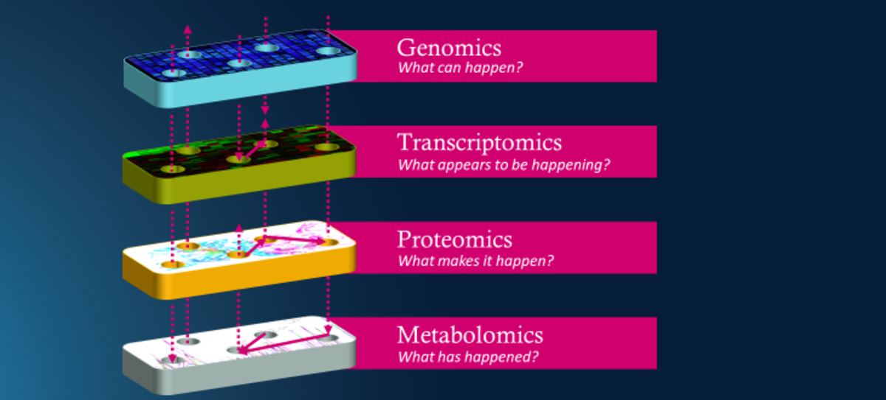
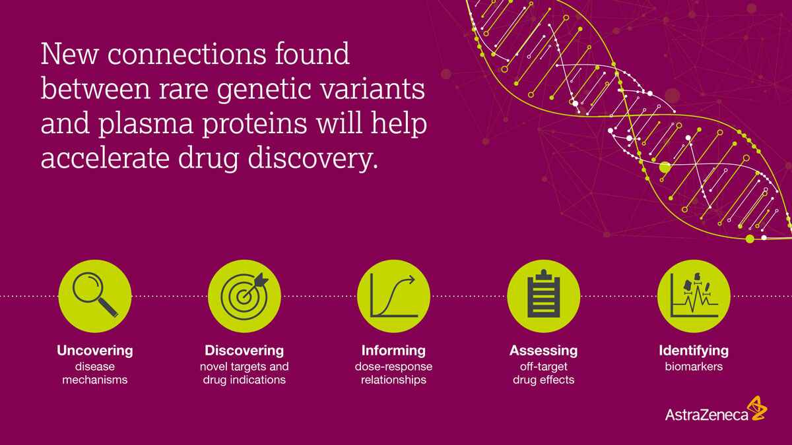
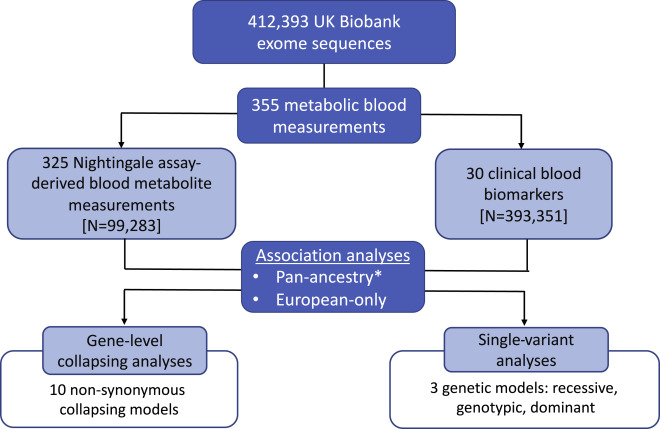
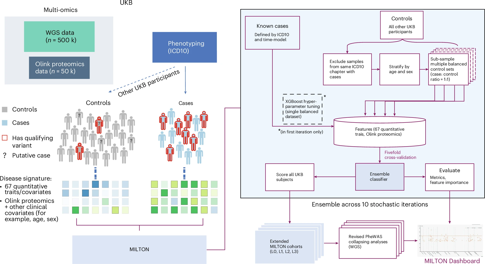

# Learning from UK Biobank by following AstraZeneca's footsteps

 

## Genomics

 Variant-level associations and Gene-level associations(Collapsing analysis):
 
 **AstraZeneca PheWAS Portal:** https://azphewas.com

 [Wang Q, Dhindsa R S, Carss K, et al. Rare variant contribution to human disease in 281,104 UK Biobank exomes[J]. Nature, 2021, 597(7877): 527-532.](https://www.nature.com/articles/s41586-021-03855-y)

 研究团队利用来自多个基因组数据集合的80多万份样本对糖尿病进行了研究，英国生物银行（UK Biobank，454,796）的外显子组数据进行了汇总分析，以检测与糖尿病相关的基因水平关联。
 结果显示，携带MAP3K15非同义变异的隐性携带者患糖尿病的可能性降低了30%（P = 5.7 × 10⁻¹⁰），且其糖化血红蛋白水平较低（β = −0.14标准差单位，P = 1.1 × 10⁻²⁴）。
 这些关联独立于体重指数（BMI），表明即使在肥胖情况下，MAP3K15变异仍对胰岛素抵抗具有保护作用。在墨西哥城前瞻性研究中对96,811名混合美洲血统个体重复验证了这些发现（P < 0.05）。
 此外，MAP3K15变异的保护效应在未携带富集于拉丁裔的SLC16A11风险单倍型的个体中更为显著（P = 6.0 × 10⁻⁴）。另外，我们在FinnGen研究中发现了一种富集于芬兰人群的MAP3K15蛋白截断变异，
 该变异与1型和2型糖尿病的风险降低相关（P < 0.05）。在UKB中，MAP3K15蛋白截断变异未与任何不良表型相关，这进一步支持将该基因作为糖尿病治疗的潜在靶点。
 鉴于1型和2型糖尿病之间的诸多差异，发现一个能同时影响这两种糖尿病风险的单一基因是非常罕见的。

 那么，MAP3K15是什么，如何预防糖尿病呢？简单的答案是，这正是我们研究的关键下一步。我们知道，胰腺是制造胰岛素的地方，而MAP3K15基因在胰腺中通常是活跃的。我们还知道，MAP3K蛋白通常通过响应化学信号帮助细胞进行交流。
 我们的希望是，MAP3K15可能是治疗糖尿病的有效靶点，来自英国生物银行、MCPS和FinnGen的数据表明，全球有成千上万，甚至数百万的人MAP3K15水平较低，甚至完全缺乏该蛋白，而他们身体健康。
 总体而言，我们的研究表明，MAP3K15可能是预防、甚至治疗糖尿病的安全靶点。如果在进一步的临床前研究中得到验证，那么针对MAP3K15的药物可能会改变糖尿病的医疗模式，帮助遏制全球糖尿病病例的迅速增长，使更多人能够过上更好、更健康的生活。

 [Nag A, Dhindsa R S, Mitchell J, et al. Human genetics uncovers MAP3K15 as an obesity-independent therapeutic target for diabetes[J]. Science advances, 2022, 8(46): eadd5430.](https://www.science.org/doi/full/10.1126/sciadv.add5430)

 https://www.astrazeneca.com/what-science-can-do/topics/disease-understanding/navigating-genetics-diabetes-resistance.html

## Transcriptomics

 [Rowland B, Venkatesh S, Tardaguila M, et al. Transcriptome-wide association study in UK Biobank Europeans identifies associations with blood cell traits[J]. Human Molecular Genetics, 2022, 31(14): 2333-2347.](https://academic.oup.com/hmg/article/31/14/2333/6524829?login=false)

## Proteomics

  **pQTL interactions from UKB-PPP**:https://astrazeneca-cgr-publications.github.io/pqtl-browser/

 在本研究49,736名英国生物银行（UK Biobank）参与者中，分析了稀有蛋白编码变异与2,923种血浆蛋白丰度之间的关联。 通过变异水平的外显子组关联研究（exome-wide association study, EWAS），发现了5,433个稀有基因型-蛋白关联，其中81%未在对相同队列进行的先前全基因组关联研究中被检测到。
 
 接着，通过基因水平的汇总分析（collapsing analysis）评估了整体信号，揭示了1,962个基因-蛋白关联。在691个与蛋白截断变异相关的基因信号中，99.4%与蛋白水平的降低相关。编码参与血浆蛋白清除的清道夫受体的基因STAB1和STAB2表现为多效位点，分别与77种和41种蛋白质相关。

 通过多个应用展示了这一公开资源的实用性，包括：描述NLRC4中的等位基因系列、识别与HSD17B13中脂肪肝疾病相关变异的潜在生物标志物、以及通过整合蛋白定量性状位点（pQTL）和蛋白截断变异的汇总分析加强全表型关联研究。

 此外，揭示了克隆性造血（clonal haematopoiesis, CH）对蛋白质组的独特影响，例如发现TET2-CH与FLT3水平升高之间的关联。 研究结果强调了稀有变异在血浆蛋白丰度中的重要作用，以及蛋白质基因组学在治疗发现中的巨大价值。

 [Dhindsa R S, Burren O S, Sun B B, et al. Rare variant associations with plasma protein levels in the UK Biobank[J]. Nature, 2023, 622(7982): 339-347.](https://www.nature.com/articles/s41586-023-06547-x)

 https://www.astrazeneca.com/what-science-can-do/topics/disease-understanding/understanding-links-between-genetics-and-biology-to-advance-drug-discovery.html

## Metabolomics

全基因组关联研究（GWAS）已确立了常见和低频变异在英国生物银行（UKB）中对代谢血液测量的贡献。
为了补充现有的GWAS研究结果，我们评估了稀有蛋白编码变异在355种代谢血液测量中的贡献，包括325种主要与脂质相关的核磁共振（NMR）血液代谢物测量（由Nightingale Health Plc提供）和30种临床血液生物标志物，使用了来自UKB的412,393个外显子组序列，这些样本来自四种基因背景多样的族群。
我们进行了基因水平的汇总分析，以评估代谢血液测量中的稀有变异架构。
总的来说，我们识别出205个不同基因的显著关联（p < 1 × 10⁻⁸），其中涉及1,968个与Nightingale血液代谢物测量相关的显著关系，及331个与临床血液生物标志物相关的显著关系。
这些包括与脂质代谢物测量相关的PLIN1和CREB3L3中的稀有非同义变异，以及与肌酐相关的SYT7变异等，这些发现不仅可能提供对新生物学的见解，还可能加深我们对已知疾病机制的理解。
在所有研究中的显著临床生物标志物关联中，40%的关联在先前对同一队列进行的GWAS分析中未能检测到，这进一步强调了研究稀有变异的重要性，以便全面理解代谢血液测量的遗传结构。

 [Nag A, Dhindsa R S, Middleton L, et al. Effects of protein-coding variants on blood metabolite measurements and clinical biomarkers in the UK Biobank[J]. The American Journal of Human Genetics, 2023, 110(3): 487-498.](https://www.cell.com/ajhg/fulltext/S0002-9297(23)00046-0)
 
##  multi-omics

 machine learning with phenotype associations, **MILTON**:https://public.cgr.astrazeneca.com/milton/v1/index.html
 
 基于表型关联的机器学习，MILTON），利用来自67种常规临床生物标志物的数据进行开发，同时结合了来自5万名英国生物银行参与者的3,000种血浆蛋白测量数据。
 使用衡量机器学习性能的金标准指标——曲线下面积（AUC)，MILTON分析了3,200种疾病，成功对1,091种疾病实现高预测能力（AUC高于0.7），并对121种疾病表现出卓越性能（AUC高于0.9）。这些发现揭示了潜在的新型生物标志物特征，可在诊断前数年预测疾病风险。
 借助英国生物银行的纵向健康记录数据，MILTON能够预测在招募时尚未诊断的疾病病例，其表现远超现有的多基因风险评分（PRS）。
 MILTON在增强遗传关联分析中的效用，通过对484,230个基因组测序样本及46,327个匹配血浆蛋白质组学数据的样本进行表型广泛关联研究（PheWAS），改善了88种已知基因-疾病关系（P < 1x10⁻⁸）的信号，
 同时识别了182种未在未增强的基线队列中达到全基因组水平显著性的基因-疾病关系。我们在FinnGen生物银行中验证了这些发现，并结合了两种独立的机器学习方法，用于基因-疾病优先级排序。

 [Garg M, Karpinski M, Matelska D, et al. Disease prediction with multi-omics and biomarkers empowers case–control genetic discoveries in the UK Biobank[J]. Nature Genetics, 2024, 56(9): 1821-1831.](https://www.nature.com/articles/s41588-024-01898-1)